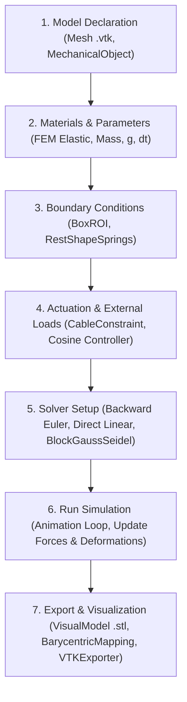

SOFT-ROBOTICS-SIMULATION---NGUYEN-DANG-DOANH

Soft robotics simulation using SOFA and SoftRobots

## 1. Simulation Objective
This project aims to simulate a soft finger controlled by cable actuation. Through this, we observe the deformation of the elastic material under pulling forces and analyze the effect of material stiffness on the bending amplitude of the finger.

## 2. Brief Software Introduction
The project utilizes the **SOFA** (Simulation Open Framework Architecture) simulation platform combined with the **SoftRobots** plugin. SOFA is a powerful open-source framework that uses the Finite Element Method (FEM) for highly accurate physical simulations of deformable objects, making it highly suitable for the Soft Robotics field.

## 3. Images and Video Results
https://github.com/user-attachments/assets/6ba1e2e1-2e64-4142-8f8a-248e72e78b16


<p align="center">
  <em>Video: Simulational process of the robotic finger</em>
<p></p>

<p align="center">
   <em>Figure 1: Curling robotic finger </em>
  <p></p>
  
## 4. Software and Library Versions
* **Python**: 3.12.1
- **SOFA**: v26.06 
- **Compulsory SOFA plugins**:
  - `SoftRobots` (Simulation of soft robotic finger and cable-driven mechanism)
  - `SofaPython3` (Python 3 inside SOFA)
- **Dependencies (Python & Module)**:
  - `Sofa.Core`, `Sofa.constants` (Python libraries included with SofaPython3)
  - `os` (Python standard library)

## 5. Installation Guide
1. Download and install SOFA (pre-compiled binaries with the SoftRobots plugin are recommended).
  - Access the download link: https://www.sofa-framework.org/download/
  - Download the OS-compatible version (Make sure to follow the installation instruction):
    
    <p align="center">
    <em>Figure 2: Main download interface </em>
    <p></p>
  - Open the .exe file and run with administrator

    

    <p align="center">
    <em>Figure 3: SOFA_v26.06.00_Win64.exe </em>
      <p></p>
  - Click next and agree with the license agreement:
    
    
    
    
<p align="center">
     <em>Figure 4&5: Downloading interface </em>
  <p></p>
  - Add SOFA to the system PATH for all users and create the icon
    
    
  - Browse for the destination folder, choose start menu folder, choose components, and click install
    
    
<p align="center">
     <em>Figure 6&7: Downloading steps </em>
  <p></p>
2. Clone this repository to your local machine:
   (https://github.com/doanh271006/SOFT-ROBOTICS-SIMULATION---NGUYEN-DANG-DOANH.git)

## 6. Execution Commands
  - Run SOFA
<p align="center">

<p></p>
<p align="center">

<p></p>
Main interface
<p align="center">

<p></p>
CMD Log

  - At the top left corner of the interface, click file and open simulation
<p align="center">

<p></p>
  - Choose file FingerwithSTLIB.py
<p align="center">

<p></p>
  - Click the Play button at the top/ Press Space to start the simulation
<p align="center">
     <em>Figure 8-12: Simulation steps </em>
  <p></p>
  
## 7. Source Code Structure (source code file: FingerwithSTLIB.py)

The project is organized including the simulation scenario configuration file, controller, and geometry/mesh data as follows:

```text
├── mesh/
│   ├── finger.vtk               # Finite element mesh (Tetrahedral Mesh) used for FEM
│   └── finger.stl               # 3D surface file used for GUI Visualization
└── FingerwithSTLIB.py           # Main file for Scene Setup and integrated Controller
```

## FingerwithSTLIB.py:
  - Contains the createScene(rootNode) function to build the SOFA Scene Graph.

  - Loads necessary SOFA plugins (SoftRobots, SofaPython3, Solvers).

  - Initializes the soft finger dynamics model (FEM, Elasticity material, BoxROI fixed boundary condition).

  - Sets up the pulling cable actuator (CableConstraint) and coordinate mapping (BarycentricMapping).

  - Integrates the Controller class (inheriting from Sofa.Core.Controller) directly into the script to listen to simulation time step events (onAnimateBeginEvent) and automatically calculate and update the cable's contraction value (value) using a smooth Cosine wave function.

### mesh:
  - Stores 3D geometric file formats for finite element calculation (.vtk) and graphic visualization (.stl).

## 8. Simulation Flowchart


## 9. Main Parameters

Below is a summary table of the key system parameters used in the simulation program:

| Parameter | Code Component | Default Value | Unit | Meaning / Role |
| :--- | :--- | :--- | :--- | :--- |
| **`youngModulus`** | `ElasticMaterialObject` | **400** | kPa | **Material stiffness of the soft finger (Study Parameter)** |
| `poissonRatio` | `ElasticMaterialObject` | 0.45 | - | Poisson's ratio of silicone/rubber material |
| `totalMass` | `ElasticMaterialObject` | 0.05 | kg | Total mass of the soft finger |
| `max_pull` | `AutoFlexController` | 40.0 | mm | Maximum cable pull displacement of the actuator |
| `gravity` | `Scene` | [0.0, -9810.0, 0.0] | mm/s² | Gravitational acceleration along the -Y axis |
| `dt` | `Scene` | 0.01 | s | Time step size for simulation computation |

## 10. Parameter Study Results 

Investigating the effect of **Material Stiffness (`youngModulus`)** on the deformation capacity and bending angle of the soft finger while keeping the maximum cable pull stroke constant at **40 mm**.

Executing the simulation with 3 different stiffness values (`youngModulus`):

### Experimental Results Table

| No. | Code Value (`youngModulus`) | Equivalent Stiffness | Material State | Observed Deformation Characteristics | Bending Degree Assessment |
| :---: | :---: | :---: | :--- | :--- | :---: |
| **1** | **`150`** | **150 kPa** | Very soft | Deepest bending at the finger body, segments bend clearly | **Very Large (~65°)** |
| **2** | **`400`** | **400 kPa** | Default (Medium) | Moderate bending, maintains geometric shape well | **Medium (~40°)** |
| **3** | **`1000`** | **1000 kPa** | Stiff | Slight bending, deformation capacity is highly restricted | **Small (~15°)** |

---

<p align="center">

  
https://github.com/user-attachments/assets/bafaed30-f510-4f3e-850a-a89ca9bb7271


<p></p>

<p align="center">
  <em>Video 2: Simulational process of the robotic finger with 150 kPa in stiffness</em>
<p></p>


<p align="center">

  
https://github.com/user-attachments/assets/c7b27b4f-c979-449c-8761-c6ba2582f76a


<p></p>

<p align="center">
  <em>Video 3: Simulational process of the robotic finger with 400 kPa in stiffness</em>
<p></p>

<p align="center">

  
https://github.com/user-attachments/assets/57bd6e57-ca7f-4c67-8c00-9b1e7fe8fc9a


<p></p>

<p align="center">
  <em>Video 4: Simulational process of the robotic finger with 1000 kPa in stiffness</em>
<p></p>

## 11. Model Limitations
* **No Physical Interaction (Collision):** The current model does not prevent self-collision if the finger is bent excessively.
* **Cable Simplification:** The cable is simulated ideally, ignoring friction between the cable and the internal cavities of the finger wall.
* **Design Constraints:** The finger is a solid block, lacking the bellows structure commonly seen in reality to optimize the bending angle.
* **Ideal Actuation Assumptions:** The simulation assumes an idealized cable pull with instantaneous response and infinite force. It does not account for the electromechanical constraints of a real actuator system, such as motor torque limits, inertia, or signal delays within the physical control loop.

**Future Developments:**
* **Physical Prototyping:** Transition from simulation to physical manufacturing using 3D printed molds to cast silicone, allowing for a direct comparison between the FEM simulation and real-world kinematic behavior.
* **Controller Upgrade:** Implement a closed-loop control system to replace the current open-loop cosine function, enabling more precise trajectory tracking.
